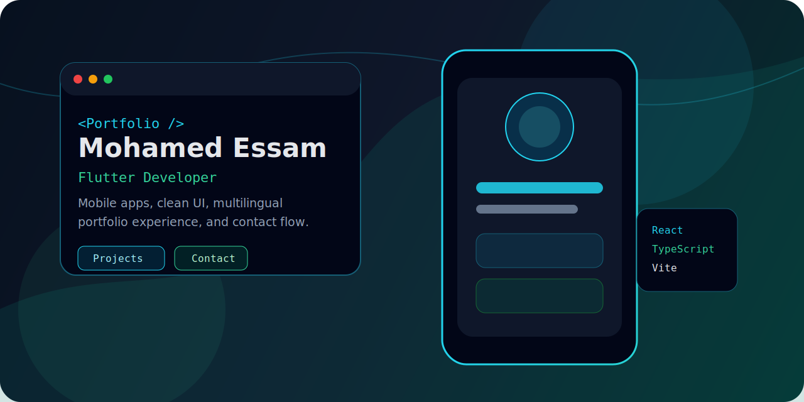
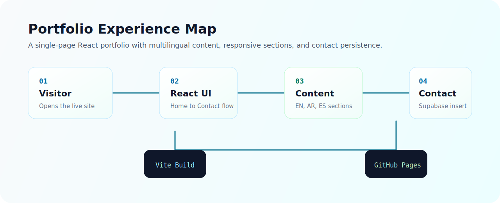
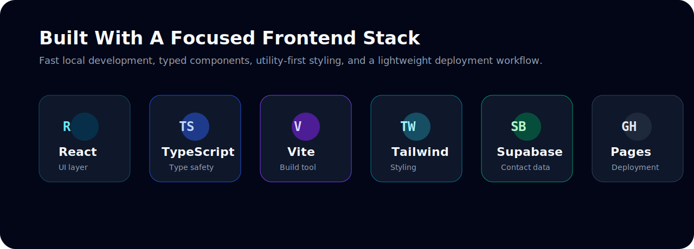

# Mohamed Essam Portfolio

<div align="center">



[](https://mohamedessam18.github.io)


**A professional multilingual portfolio for Mohamed Essam, built with React, TypeScript, Vite, Tailwind CSS, and Supabase.**

This repository is visible for portfolio and reference purposes only. It is not open source, and all rights are reserved by Mohamed Essam.

</div>

## Overview

This project is Mohamed Essam's personal portfolio website. It presents his work as a Flutter Developer and Software Developer student through a polished single-page interface with responsive sections, theme switching, multilingual content, project showcases, contact links, and a Supabase-backed contact form.

The site is designed to feel fast, clean, and practical: visitors can learn who Mohamed is, review his skills and projects, download his CV, and contact him from one focused experience.

## Live Website

Visit the production site:

**[mohamedessam18.github.io](https://mohamedessam18.github.io)**

## Preview



## Features

- Responsive single-page portfolio experience
- Dark and light theme support with saved preference
- English, Arabic, and Spanish interface content
- RTL layout handling for Arabic
- Animated hero section with profile image and visual background
- Skills, education, services, projects, and contact sections
- Supabase contact form submission flow
- Social links for GitHub, LinkedIn, Telegram, Instagram, and email
- CV download from the public assets folder
- GitHub Pages deployment workflow

## Tech Stack



| Area | Tools |
| --- | --- |
| Frontend | React 19, TypeScript, Vite |
| Styling | Tailwind CSS, shadcn-style UI primitives, Radix UI |
| Motion and Icons | Framer Motion, Lucide React |
| Data | Supabase contact form table |
| Deployment | GitHub Pages, gh-pages |

## Project Structure

```text
.
|-- pics/                   README images and documentation visuals
|-- public/                 Public files, favicon, and CV
|-- src/
|   |-- assets/             Local image assets
|   |-- components/         Shared UI and layout components
|   |-- hooks/              Theme, language, and local storage hooks
|   |-- lib/                Utilities and Supabase client
|   |-- sections/           Portfolio page sections
|   |-- App.tsx             Main application composition
|   |-- i18n.ts             Translation content and language logic
|   |-- index.css           Global styles
|   `-- main.tsx            React entry point
|-- COPYRIGHT.md            Copyright notice
|-- LICENSE                 Proprietary license terms
|-- README.md               Project documentation
|-- index.html              Vite HTML entry
|-- package.json            Scripts and dependencies
|-- tailwind.config.js      Tailwind configuration
`-- vite.config.ts          Vite configuration
```

## Getting Started

This setup is intended for Mohamed Essam and explicitly authorized collaborators.

### Prerequisites

- Node.js 20 or newer
- npm
- Supabase project credentials for the contact form

### Installation

```bash
git clone https://github.com/mohamedessam18/mohamedessam18.github.io.git
cd mohamedessam18.github.io
npm install
```

### Environment Variables

Create a `.env.local` file in the project root:

```env
VITE_SUPABASE_URL=your_supabase_project_url
VITE_SUPABASE_ANON_KEY=your_supabase_anon_key
```

The contact form expects a Supabase table named:

```text
contact_messages
```

The current form writes `name` and `email` values to that table.

## Available Scripts

| Command | Purpose |
| --- | --- |
| `npm run dev` | Start the Vite development server |
| `npm run build` | Type-check and build the production bundle |
| `npm run preview` | Preview the production build locally |
| `npm run deploy` | Publish the built site to GitHub Pages |

## Deployment

The app is configured for GitHub Pages through the `homepage` field in `package.json` and the `gh-pages` deployment script.

```bash
npm run deploy
```

The `predeploy` script runs the production build before publishing the `dist/` folder.

## Portfolio Sections

| Section | Purpose |
| --- | --- |
| Home | Introduction, profile image, and primary calls to action |
| About | Personal summary, goals, and developer highlights |
| Skills | Core, supporting, soft skills, and additional knowledge |
| Education / Experience | Education and growth context |
| Help | Services Mohamed can provide with Flutter projects |
| Projects | Featured GitHub projects and technology tags |
| Contact | Contact form, social links, email, and CV download |

## Ownership And License

This project is proprietary and not open source.

Copyright (c) 2026 Mohamed Essam. All rights reserved. No part of this source code, design, content, images, documentation, or assets may be copied, modified, distributed, sublicensed, published, sold, reused, or used commercially without prior written permission.

See [LICENSE](LICENSE) and [COPYRIGHT.md](COPYRIGHT.md) for the full ownership and usage terms.

## Author

**Mohamed Essam**

- GitHub: [@mohamedessam18](https://github.com/mohamedessam18)
- LinkedIn: [mohammedessam2](https://www.linkedin.com/in/mohammedessam2)
- Telegram: [@mohvmedesam20](https://t.me/mohvmedesam20)
- Instagram: [@mohvmedesam20](https://www.instagram.com/mohvmedesam20)
- Email: [mohvmedesam@gmail.com](mailto:mohvmedesam@gmail.com)
